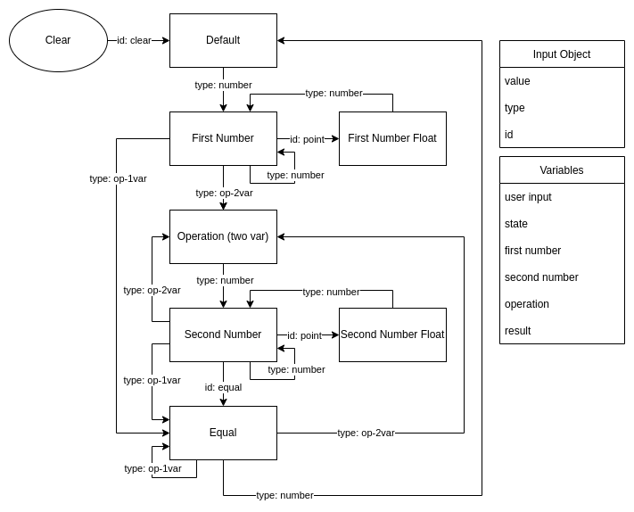

# Calc4me

A simple calculator with:
* simple functions: addition, subtraction, multiplication, division;
* more advanced functions: percentual, factorial, exponential, roots;
* conversion units: feet, meter, inches, centimeter;
* non-integer handling;
* overflow handling;
* keyboard support;
* delete inputs;
# Flowchart  
Superficial flowchart of the process.

    

